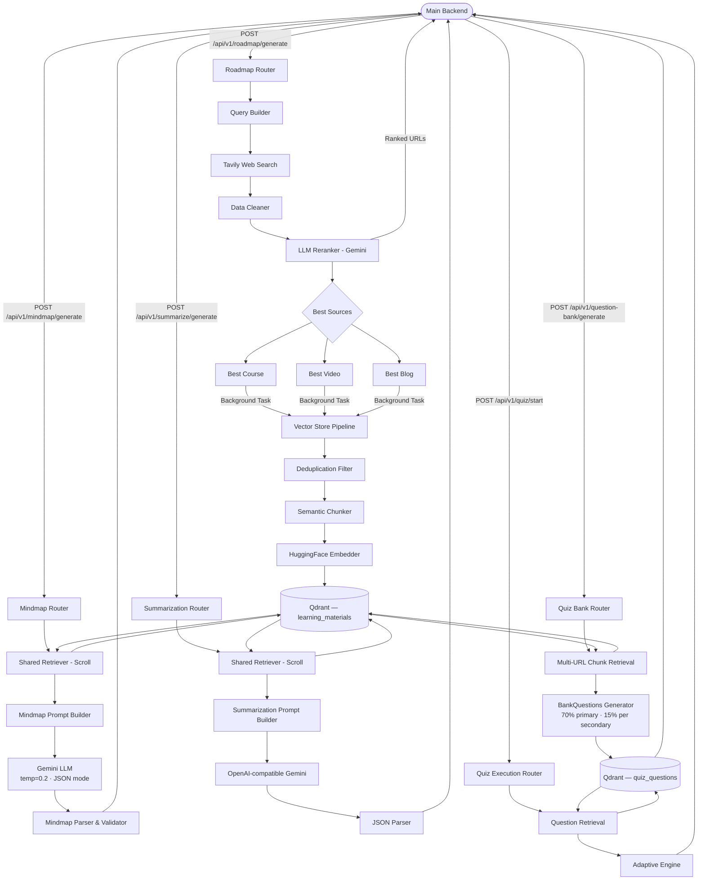
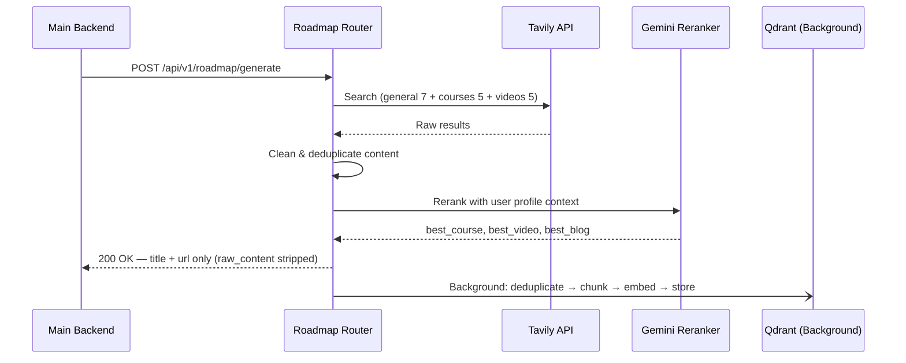
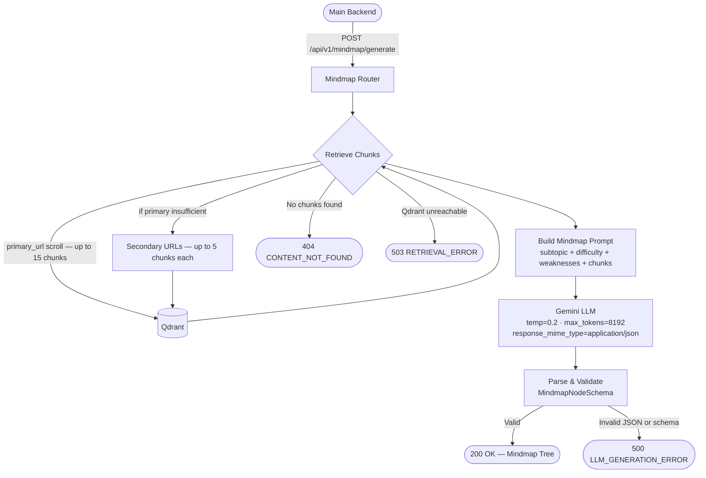
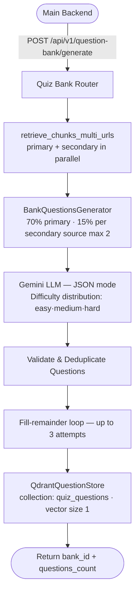
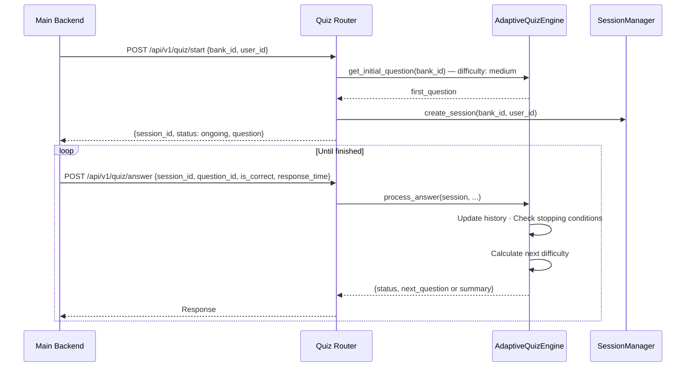
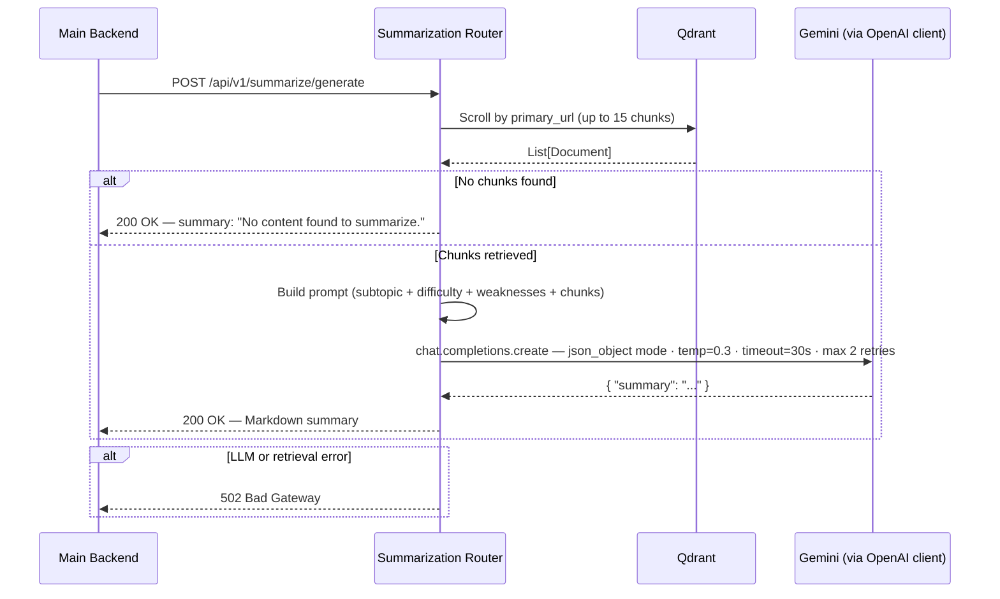

# Learning Services

## Table of Contents

- [Learning Services](#learning-services)
  - [Table of Contents](#table-of-contents)
  - [Overview](#overview)
  - [System Architecture \& Workflow](#system-architecture--workflow)
    - [Step-by-Step Flow Explanation](#step-by-step-flow-explanation)
  - [Feature: Roadmap Generation](#feature-roadmap-generation)
  - [Feature: Mindmap Generation](#feature-mindmap-generation)
  - [Feature: Quiz Generation](#feature-quiz-generation)
    - [Quiz Bank Generation Flow](#quiz-bank-generation-flow)
    - [Adaptive Quiz Session Flow](#adaptive-quiz-session-flow)
  - [Feature: Summarization](#feature-summarization)
  - [Project Structure](#project-structure)
  - [Tech Stack](#tech-stack)
  - [Setup \& Installation](#setup--installation)
    - [1. Prerequisites](#1-prerequisites)
    - [2. Clone the Repository](#2-clone-the-repository)
    - [3. Environment Setup](#3-environment-setup)
    - [4. Start Qdrant](#4-start-qdrant)
    - [5. Install Dependencies](#5-install-dependencies)
    - [6. Setup Pre-commit Hooks](#6-setup-pre-commit-hooks)
  - [Running the Application](#running-the-application)
  - [Testing](#testing)
  - [Contribution Guidelines \& Git Workflow](#contribution-guidelines--git-workflow)
    - [1. Branching Strategy](#1-branching-strategy)
    - [2. Commits](#2-commits)
    - [3. Pull Requests](#3-pull-requests)
  - [License](#license)

---

## Overview

The **Learning Services** is an intelligent backend AI engine designed to generate personalized educational content including roadmaps, mind maps, quizzes, and summaries. By leveraging user profile data (such as learning styles, study time, and goals) alongside specific target subtopics, the system dynamically fetches, processes, and curates educational content.

It integrates:
- **Tavily API** for real-time web search
- **Google Gemini** (`gemini-2.5-flash-lite`) as the core LLM for reranking and generation
- **Qdrant** as a vector database for semantic retrieval (two collections: `learning_materials` and `quiz_questions`)
- **HuggingFace** multilingual embeddings (`paraphrase-multilingual-mpnet-base-v2`) for Arabic & English support
- **OpenAI-compatible Gemini endpoint** for summarization and quiz question generation

---

## System Architecture & Workflow



### Step-by-Step Flow Explanation

1. **Input Collection** — The Main Backend sends user profile (tracks, learning style, goals) and target subtopic (name, description, difficulty).
2. **Web Search & Extraction** — A targeted query is built and sent to Tavily, fetching articles, courses (Coursera, Udemy), and YouTube videos. Raw content is cleaned (HTML tags, boilerplate, URLs removed).
3. **LLM Reranker / Judge** — Gemini evaluates all sources and selects the single best course, video, and blog for this specific learner.
4. **Vector Store Pipeline** — In the background, each selected source is deduplicated (by `metadata.url`), semantically chunked, embedded, and stored in the `learning_materials` Qdrant collection.
5. **Content Generation** — The user can then request a Mindmap, Summary, or Quiz. The system retrieves relevant chunks from Qdrant using `metadata.url` scroll-based filtering and feeds them to Gemini for generation.
6. **Quiz Flow** — Questions are generated from retrieved chunks and stored in a separate `quiz_questions` Qdrant collection. An adaptive engine then manages the quiz session, adjusting difficulty based on performance.

---

## Feature: Roadmap Generation

Generates a personalized learning roadmap by searching, ranking, and returning the best course, video, and blog for a given subtopic. Qdrant ingestion runs as a fire-and-forget background task.



---

## Feature: Mindmap Generation

Generates a hierarchical mind map (max 2 levels deep, 4–5 main branches) from content already stored in Qdrant for a specific subtopic source. Uses scroll-based retrieval — not similarity search.



**Mindmap constraints enforced by the prompt:**
- Root node topic always equals `subtopic_name`
- Max 2 levels of depth (Root → Branch → Sub-topic)
- 4–5 main branches, up to 4 sub-topics per branch
- Leaf node descriptions are always empty string `""`
- Vendor-neutral: source-specific jargon (e.g. PL/SQL, T-SQL) is mapped to standard concepts

---

## Feature: Quiz Generation

An AI-powered feature that transforms stored content into a personalized quiz bank and delivers questions adaptively.

### Quiz Bank Generation Flow



**Key generation details:**
- Total bank size: 100 questions (configurable via `QUIZ_BANK_SIZE`)
- 70% from primary source, up to 15% per secondary (max 2 secondary sources used)
- Each question includes: `content`, `options`, `correct_answer`, `difficulty`, `explanations` (per-option)
- Deduplication uses normalized text comparison (punctuation stripped, lowercased)
- Up to 3 fill-remainder attempts if target count not reached

### Adaptive Quiz Session Flow



**Adaptive engine stopping conditions:**
- Minimum 5 questions answered before any early stop
- Maximum 15 questions
- High confidence score (≥ 0.85) — composite of recent accuracy, consistency, speed, and question count
- 3 consecutive correct answers at `hard` difficulty → mastery detected
- 3 consecutive wrong answers at `easy` difficulty → struggling detected

**Confidence score formula:**
`recent_accuracy(last 5) × 0.35 + consistency × 0.25 + question_count_progress × 0.25 + speed_score × 0.15`

---

## Feature: Summarization

Provides structured, Markdown-formatted summaries by distilling content from Qdrant using scroll-based retrieval on `primary_url` only, then processing with an OpenAI-compatible Gemini pipeline.



---

## Project Structure

```text
learning-services/
├── src/
│   ├── ai_engine/
│   │   ├── data_fetchers/
│   │   │   ├── chunks_retrieval.py         # Single-URL scroll retrieval (used by quiz)
│   │   │   ├── cleaned_tavily_data.py      # Pipeline: fetch + clean subtopic content
│   │   │   ├── data_cleaner.py             # Regex-based text sanitization
│   │   │   ├── query_builder.py            # Build targeted search queries
│   │   │   ├── tavily_client.py            # Async Tavily: 3 parallel searches (general+courses+videos)
│   │   │   └── qdrant_client_dependency.py # Shared AsyncQdrantClient (DI, startup/shutdown)
│   │   │
│   │   ├── llm_generators/
│   │   │   ├── reranker.py                 # LLM reranking orchestrator (singleton Gemini client)
│   │   │   ├── reranker_parser.py          # JSON parser + raw_content enricher
│   │   │   ├── reranker_prompt.py          # Reranker prompt builder (1500 char preview per source)
│   │   │   └── source_classifier.py        # URL-based source type classifier (course/video/blog)
│   │   │
│   │   ├── mindmap_feature/
│   │   │   ├── mindmap_generator.py        # Gemini mindmap generation (thread-safe singleton)
│   │   │   ├── mindmap_parser.py           # JSON → MindmapNodeSchema validator
│   │   │   ├── mindmap_prompt.py           # Mindmap prompt (vendor-neutral, strict size limits)
│   │   │   └── retriever.py                # Delegates to shared_retriever for chunk fetching
│   │   │
│   │   ├── summarization_engine/
│   │   │   ├── summarizer.py               # Summarization service (retry logic, JSON parse)
│   │   │   ├── summarization_prompt.py     # Prompt builder (Markdown output, language-aware)
│   │   │   └── openai_client_dependency.py # Shared AsyncOpenAI client for summarization
│   │   │
│   │   ├── text_processing/
│   │   │   └── chunker.py                  # SemanticChunker (percentile 85, max 4000 chars/chunk)
│   │   │
│   │   ├── vector_store/
│   │   │   ├── embedder.py                 # HuggingFace embeddings singleton (batch_size=32)
│   │   │   ├── filters.py                  # Deduplication check by metadata.url (sync)
│   │   │   ├── prepare_store_document.py   # Concurrent source processing + video transcript cleaning
│   │   │   ├── qdrant_client.py            # Sync QdrantClient singleton + collection setup (768 dims)
│   │   │   ├── shared_retriever.py         # Shared scroll retriever (primary + secondary URLs)
│   │   │   └── store.py                    # Ingestion entry point (async, to_thread for CPU ops)
│   │   │
│   │   └── quiz_feature/
│   │       ├── adaptive_engine.py          # AdaptiveQuizEngine (confidence scoring, difficulty routing)
│   │       ├── session_analytics.py        # SessionAnalytics (accuracy, consistency, speed scores)
│   │       ├── session_manager.py          # In-memory SessionManager (UUID sessions)
│   │       ├── question_retrieval.py       # QuestionRetrieval (random selection from candidates)
│   │       ├── qdrant_question_store.py    # QdrantQuestionStore (upsert with vector=[0.0])
│   │       ├── quiz_qdrant_client.py       # Separate Qdrant client for quiz_questions collection
│   │       ├── ChunksRetrieval.py          # Multi-URL parallel chunk retrieval with is_primary tagging
│   │       ├── BankQuestions_prompts.py    # MCQ prompt builder (strict JSON, per-option explanations)
│   │       │
│   │       └── BankQuestions_engine/
│   │           ├── BankQuestions_generator.py   # Generator: 70/15/15 split, dedup, fill-remainder
│   │           └── openai_client_dependency.py  # Shared AsyncOpenAI client for quiz generation
│   │
│   ├── core/
│   │   ├── config.py                       # Pydantic BaseSettings (all env vars + defaults)
│   │   ├── constants.py                    # Global constants (currently empty)
│   │   ├── exceptions.py                   # Custom exception classes
│   │   ├── messages.py                     # Standardized log/response messages
│   │   └── mock_data.py                    # Static sample data for tests
│   │
│   ├── models/
│   │   ├── schemas.py                      # Pydantic schemas (Roadmap, Mindmap)
│   │   ├── summarization_schemas.py        # Summarization request/response schemas
│   │   ├── quiz_schemas.py                 # Quiz request/response + Question/QuizBank schemas
│   │   └── BankQuestions_schemas.py        # Bank questions schemas
│   │
│   ├── routers/
│   │   ├── base.py                         # Root/welcome endpoint (GET /api/v1/)
│   │   ├── roadmap.py                      # POST /api/v1/roadmap/generate
│   │   ├── mindmap.py                      # POST /api/v1/mindmap/generate
│   │   ├── summarization_router.py         # POST /api/v1/summarize/generate
│   │   └── quiz_routers.py                 # POST /api/v1/question-bank/generate · /quiz/start · /quiz/answer
│   │
│   ├── services/
│   │   └── main_backend_client.py          # HTTPX client for main backend
│   │
│   └── main.py                             # FastAPI app + startup/shutdown lifecycle
│
├── tests/
│   ├── conftest.py                         # pytest fixtures, --integration flag, shared embedding model
│   ├── test_config.py                      # Settings defaults and env override tests
│   │
│   ├── mindmap/
│   │   ├── unit/test_mindmap_unit.py       # Parser, prompt builder, retriever, generator (mocked)
│   │   └── integration/test_mindmap_integration.py
│   │
│   ├── roadmap/
│   │   ├── unit/
│   │   │   ├── test_reranker.py
│   │   │   ├── test_roadmap_router.py
│   │   │   ├── test_tavily_client.py
│   │   │   ├── test_vector_store_unit.py
│   │   │   ├── test_chunker.py
│   │   │   └── test_cleaned_tavily_data.py
│   │   └── integration/
│   │       ├── test_full_pipeline_integration.py
│   │       ├── test_chunker_integration.py
│   │       ├── test_reranker_integration.py
│   │       ├── test_tavily_integration.py
│   │       └── test_vector_store_integration.py
│   │
│   ├── summarization/
│   │   ├── unit/test_summarization_unit.py
│   │   └── integration/test_summarization_integration.py
│   │
│   └── quiz/
│       └── unit/
│           ├── test_bank_questions.py      # Generator, store, retrieval, session manager
│           └── test_adaptive_engine.py     # Adaptive engine flow and stopping conditions
│
├── docs/
│   ├── Roadmap_API_Contract.md
│   ├── Mindmap_API_Contract.md
│   ├── Summarization_API_contract.md
│   ├── Qdrant_Schema.md
│   └── Quiz_API_Contract.md
│
├── .env.example
├── .gitignore
├── .pre-commit-config.yaml
├── docker-compose.yml
├── requirements.txt
└── README.md
```

---

## Tech Stack

| Layer | Technology |
|---|---|
| Framework | FastAPI 0.135 + Uvicorn 0.41 |
| Validation | Pydantic v2 |
| LLM | Google Gemini `gemini-2.5-flash-lite` (via `google-genai` + OpenAI-compatible endpoint) |
| Vector DB | Qdrant (AsyncQdrantClient) — two collections |
| Embeddings | HuggingFace `paraphrase-multilingual-mpnet-base-v2` (768 dims, multilingual) |
| Web Search | Tavily Python Client (3 parallel searches) |
| HTTP Client | HTTPX |
| Text Splitting | LangChain `SemanticChunker` (percentile 85 breakpoint) |
| Testing | Pytest + Pytest-Asyncio + Respx + unittest.mock |
| Code Quality | Pre-commit, Black 24.2, Ruff 0.2.2 |
| Database | PostgreSQL + SQLAlchemy + psycopg2 (via main backend) |

---

## Setup & Installation

### 1. Prerequisites

- Python 3.11+
- Docker (for Qdrant)

### 2. Clone the Repository

```bash
git clone <repo-url>
cd learning-services
```

### 3. Environment Setup

Create a virtual environment and activate it:

```bash
python -m venv .venv
source .venv/bin/activate  # On Windows: .venv\Scripts\activate
```

Create a `.env` file from the provided example:

```bash
cp .env.example .env
```

Fill in your keys:

```env
APP_NAME="Learning Services"
APP_VERSION="1.0.0"
MAIN_BACKEND_URL="http://localhost:3000"
TAVILY_API_KEY="your_tavily_key"
GEMINI_API_KEY="your_gemini_key"
QDRANT_URL="http://localhost:6333"
QDRANT_COLLECTION_NAME="learning_materials"
QUIZ_COLLECTION_NAME="quiz_questions"
HF_TOKEN="your_huggingface_token"
```

### 4. Start Qdrant

```bash
docker-compose up -d
```

This starts Qdrant on port `6333` with persistent storage in a named Docker volume.

### 5. Install Dependencies

```bash
pip install -r requirements.txt
```

### 6. Setup Pre-commit Hooks

```bash
pip install pre-commit
pre-commit install
```

---

## Running the Application

```bash
uvicorn src.main:app --reload
```

- API base: `http://localhost:8000`
- Swagger docs: `http://localhost:8000/docs`
- ReDoc: `http://localhost:8000/redoc`

**Startup sequence:** On startup, the app initializes the OpenAI client (for quiz + summarization), the shared Qdrant client (for all features), and ensures the `quiz_questions` collection exists. The `learning_materials` collection is created lazily on first ingestion.

---

## Testing

Run all unit tests (no external services required):

```bash
pytest -v -s
```

Run with live logs:

```bash
pytest -v -s --log-cli-level=INFO
```

Run integration tests (requires real API keys + running Qdrant, and content already ingested via roadmap endpoint):

```bash
pytest --integration -v -s --log-cli-level=INFO
```

Run a specific test file:

```bash
pytest tests/mindmap/unit/test_mindmap_unit.py -v
pytest tests/quiz/unit/test_adaptive_engine.py -v
```

> **Note:** Integration tests for mindmap and summarization require content to already be stored in Qdrant (i.e., `POST /api/v1/roadmap/generate` must have been called first for the relevant URLs).

---

## Contribution Guidelines & Git Workflow

### 1. Branching Strategy

| Branch | Purpose |
|---|---|
| `main` | Production-ready code — direct pushes **blocked** |
| `develop` | Integration branch — all PRs target here |

**Feature branch naming:**

```text
feat/feature-name     → feat/quiz-adaptive-engine
fix/bug-name          → fix/qdrant-scroll-offset
chore/task-name       → chore/update-dependencies
docs/document-name    → docs/quiz-api-contract
```

### 2. Commits

Use conventional commit messages:

```text
✅ feat: add adaptive quiz engine with confidence scoring
✅ fix: handle empty primary chunks during mindmap retrieval
✅ chore: update requirements.txt
❌ fixed bug
❌ updated files
❌ done
```

### 3. Pull Requests

- Direct pushes to `main` or `develop` are **blocked**
- Open a PR against `develop`
- Fill in the PR template
- Requires at least **1 approval** from the Team Lead
- All pre-commit checks and tests must pass

---

## License

This project is protected under a **Custom Educational & Contributor License**.

The source code is open for **personal learning and educational purposes only**. Commercial use, unauthorized redistribution, or use in production environments without explicit permission is strictly prohibited.

See the `LICENSE` file for full details.
