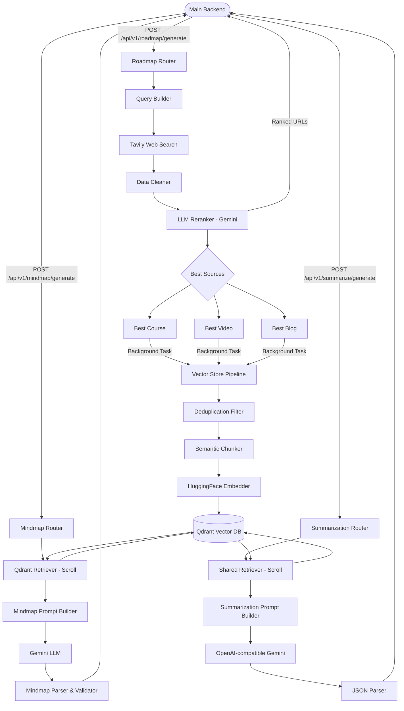
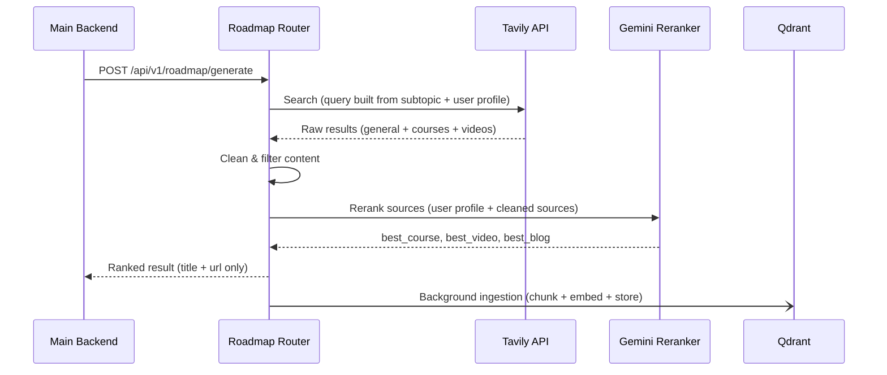
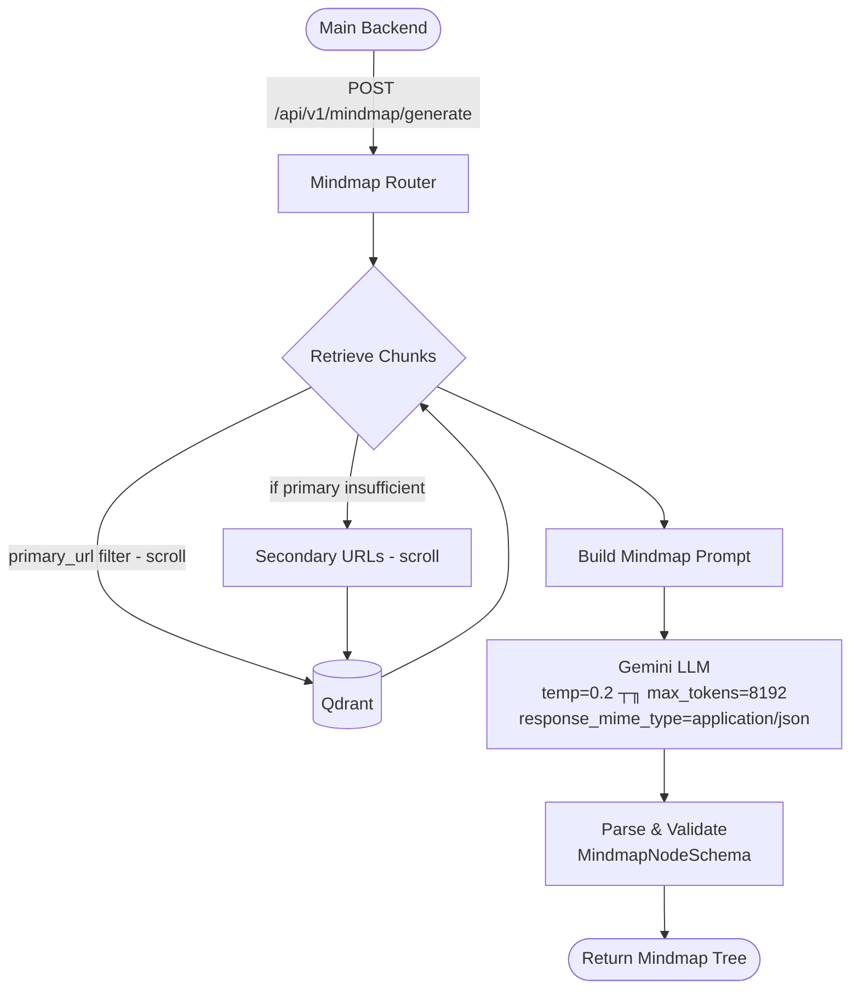
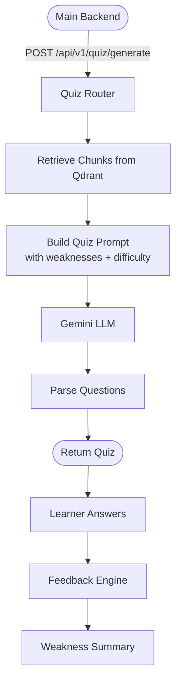
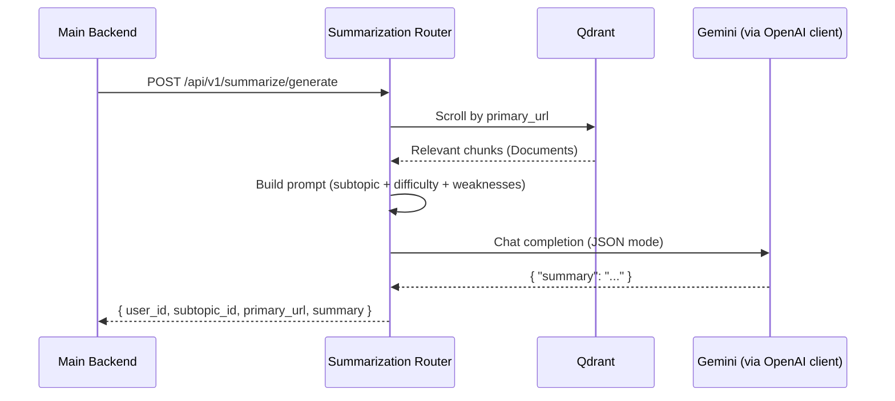

# Learning Services

## Table of Contents

- [Learning Services](#learning-services)
  - [Table of Contents](#table-of-contents)
  - [Overview](#overview)
  - [System Architecture \& Workflow](#system-architecture--workflow)
    - [Step-by-Step Flow Explanation](#step-by-step-flow-explanation)
  - [Feature: Roadmap Generation](#feature-roadmap-generation)
  - [Feature: Mindmap Generation](#feature-mindmap-generation)
    - [Mindmap Flow](#mindmap-flow)
  - [Feature: Quiz Generation](#feature-quiz-generation)
  - [Feature: Summarization](#feature-summarization)
  - [Project Structure](#project-structure)
  - [Tech Stack](#tech-stack)
  - [Setup \& Installation](#setup--installation)
    - [1. Prerequisites](#1-prerequisites)
    - [2. Clone the Repository](#2-clone-the-repository)
    - [3. Environment Setup](#3-environment-setup)
    - [4. Start Qdrant](#4-start-qdrant)
    - [5. Install Dependencies](#5-install-dependencies)
    - [6. Setup Pre-commit Hooks](#6-setup-pre-commit-hooks)
  - [Running the Application](#running-the-application)
  - [Testing](#testing)
  - [Contribution Guidelines \& Git Workflow](#contribution-guidelines--git-workflow)
    - [1. Branching Strategy](#1-branching-strategy)
    - [2. Commits](#2-commits)
    - [3. Pull Requests](#3-pull-requests)
  - [License](#license)

---

## Overview

The **Learning Services** is an intelligent backend AI engine designed to generate personalized educational roadmaps and learning materials. By leveraging user profile data (such as learning styles, study time, and goals) alongside specific target subtopics, the system dynamically fetches, processes, and curates educational content.

It integrates:
- **Tavily API** for real-time web search
- **Google Gemini** as the core LLM for reranking and generation
- **Qdrant** as a vector database for semantic retrieval
- **HuggingFace** multilingual embeddings for Arabic & English support

---

## System Architecture & Workflow



### Step-by-Step Flow Explanation

1. **Input Collection** ΓÇö The Main Backend sends user profile (tracks, learning style, goals) and target subtopic (name, description, difficulty).
2. **Web Search & Extraction** ΓÇö A targeted query is built and sent to Tavily, fetching articles, courses (Coursera, Udemy), and YouTube videos. Raw content is cleaned (HTML tags, boilerplate, URLs removed).
3. **LLM Reranker / Judge** ΓÇö Gemini evaluates all sources and selects the single best course, video, and blog for this specific learner.
4. **Vector Store Pipeline** ΓÇö In the background, each selected source is deduplicated, semantically chunked, embedded, and stored in Qdrant.
5. **Content Generation** ΓÇö The user can then request a Mindmap or Summary. The system retrieves relevant chunks from Qdrant using `primary_url` filtering and feeds them to Gemini for generation.

---

## Feature: Roadmap Generation

Generates a personalized learning roadmap by searching, ranking, and returning the best course, video, and blog for a given subtopic.



---

## Feature: Mindmap Generation

Generates a hierarchical mind map from content already stored in Qdrant for a specific subtopic source.



### Mindmap Flow

**Phase 1 ΓÇö Request & Context**
The router receives the request with `primary_url`, subtopic info, and user weaknesses. No additional backend call is made.

**Phase 2 ΓÇö Retrieval from Qdrant**
Chunks are fetched using strict `metadata.url` scroll-based retrieval (not similarity search). Primary URL is fetched first; secondary URLs supplement if needed.

**Phase 3 ΓÇö Generation & Response**
The chunks are assembled into a structured prompt. Gemini generates the mindmap. Output is parsed and validated into `MindmapNodeSchema` before returning.

---

## Feature: Quiz Generation

An AI-powered feature that transforms a learner's selected content source into a personalized quiz experience with adaptive difficulty and instant corrective feedback.



---

## Feature: Summarization

Provides structured, beginner-friendly summaries by distilling content from Qdrant using vector scroll retrieval, then processing with an OpenAI-compatible Gemini pipeline.



---

## Project Structure

```text
learning-services/
├── src/
│   ├── ai_engine/
│   │   ├── data_fetchers/
│   │   │   ├── cleaned_tavily_data.py      # Pipeline: fetch + clean subtopic content
│   │   │   ├── data_cleaner.py             # Regex-based text sanitization
│   │   │   ├── query_builder.py            # Build targeted search queries
│   │   │   ├── tavily_client.py            # Async Tavily web search wrapper
│   │   │   ├── chunks_retrieval.py         # Retrieve chunks from Qdrant by URL
│   │   │   └── qdrant_client_dependency.py # Shared AsyncQdrantClient (DI)
│   │   │
│   │   ├── llm_generators/
│   │   │   ├── reranker.py                 # LLM reranking orchestrator
│   │   │   ├── reranker_parser.py          # JSON parser + raw_content enricher
│   │   │   ├── reranker_prompt.py          # Reranker prompt builder
│   │   │   └── source_classifier.py        # URL-based source type classifier
│   │   │
│   │   ├── mindmap_feature/
│   │   │   ├── mindmap_generator.py        # Gemini mindmap generation
│   │   │   ├── mindmap_parser.py           # JSON → MindmapNodeSchema validator
│   │   │   ├── mindmap_prompt.py           # Mindmap prompt builder
│   │   │   └── retriever.py                # Retrieve chunks for mindmap
│   │   │
│   │   ├── summarization_engine/
│   │   │   ├── summarizer.py               # Summarization orchestrator
│   │   │   ├── summarization_prompt.py     # Summarization prompt builder
│   │   │   └── openai_client_dependency.py # Shared AsyncOpenAI client (DI)
│   │   │
│   │   ├── text_processing/
│   │   │   └── chunker.py                  # Semantic chunker (multilingual)
│   │   │
│   │   └── vector_store/
│   │       ├── embedder.py                 # HuggingFace embedding model loader
│   │       ├── filters.py                  # Deduplication by URL
│   │       ├── prepare_store_document.py   # Document preparation pipeline
│   │       ├── qdrant_client.py            # Sync QdrantClient + collection setup
│   │       ├── shared_retriever.py         # Shared scroll-based retriever
│   │       └── store.py                    # Ingestion entry point
│   │
│   ├── core/
│   │   ├── config.py                       # Pydantic BaseSettings
│   │   ├── constants.py                    # Global constants
│   │   ├── exceptions.py                   # Custom exception classes
│   │   ├── messages.py                     # Standardized response messages
│   │   └── mock_data.py                    # Static sample data for tests
│   │
│   ├── models/
│   │   ├── schemas.py                      # Pydantic schemas (Roadmap, Mindmap)
│   │   └── summarization_schemas.py        # Summarization request/response schemas
│   │
│   ├── routers/
│   │   ├── base.py                         # Root/welcome endpoint
│   │   ├── roadmap.py                      # Roadmap generation endpoints
│   │   ├── mindmap.py                      # Mindmap generation endpoints
│   │   └── summarization_router.py         # Summarization endpoints
│   │
│   ├── services/
│   │   └── main_backend_client.py          # HTTPX client for main backend
│   │
│   └── main.py                             # FastAPI app + startup/shutdown events
│
├── tests/
│   ├── mindmap/
│   │   ├── unit/test_mindmap_unit.py
│   │   └── integration/test_mindmap_integration.py
│   │
│   ├── roadmap/
│   │   ├── unit/
│   │   │   ├── test_reranker.py
│   │   │   ├── test_roadmap_router.py
│   │   │   ├── test_tavily_client.py
│   │   │   ├── test_vector_store_unit.py
│   │   │   ├── test_chunker.py
│   │   │   └── test_cleaned_tavily_data.py
│   │   │
│   │   └── integration/
│   │       ├── test_full_pipeline_integration.py
│   │       ├── test_chunker_integration.py
│   │       ├── test_reranker_integration.py
│   │       ├── test_tavily_integration.py
│   │       └── test_vector_store_integration.py
│   │
│   ├── summarization/
│   │   ├── unit/test_summarization_unit.py
│   │   └── integration/test_summarization_integration.py
│   │
│   └── test_config.py
│
├── docs/
│   ├── Roadmap_API_Contract.md
│   ├── Mindmap_API_Contract.md
│   ├── Summarization_API_contract.md
│   └── Qdrant_Schema.md
│
├── .env.example
├── .gitignore
├── .pre-commit-config.yaml
├── docker-compose.yml
├── requirements.txt
└── README.md
```

---

## Tech Stack

| Layer | Technology |
|---|---|
| Framework | FastAPI + Uvicorn |
| Validation | Pydantic v2 |
| LLM | Google Gemini (via `google-genai` + OpenAI-compatible endpoint) |
| Vector DB | Qdrant (AsyncQdrantClient) |
| Embeddings | HuggingFace `paraphrase-multilingual-mpnet-base-v2` (768 dims) |
| Web Search | Tavily Python Client |
| HTTP Client | HTTPX |
| Text Splitting | LangChain SemanticChunker |
| Testing | Pytest + Pytest-Asyncio + Respx |
| Code Quality | Pre-commit, Black, Ruff |
| Database | PostgreSQL + SQLAlchemy (psycopg2) |

---

## Setup & Installation

### 1. Prerequisites

- Python 3.11+
- Docker (for Qdrant)

### 2. Clone the Repository

```bash
git clone <repo-url>
cd learning-services
```

### 3. Environment Setup

Create a virtual environment and activate it:

```bash
python -m venv .venv
source .venv/bin/activate  # On Windows: .venv\Scripts\activate
```

Create a `.env` file from the provided example:

```bash
cp .env.example .env
```

Fill in your keys:

```env
APP_NAME="Learning Services"
APP_VERSION="1.0.0"
MAIN_BACKEND_URL="http://localhost:3000"
TAVILY_API_KEY="your_tavily_key"
GEMINI_API_KEY="your_gemini_key"
QDRANT_URL="http://localhost:6333"
QDRANT_COLLECTION_NAME="learning_materials"
QUIZ_COLLECTION_NAME: str = "quiz_questions"
HF_TOKEN="your_huggingface_token"
```

### 4. Start Qdrant

```bash
docker-compose up -d
```

### 5. Install Dependencies

```bash
pip install -r requirements.txt
```

### 6. Setup Pre-commit Hooks

```bash
pip install pre-commit
pre-commit install
```

---

## Running the Application

```bash
uvicorn src.main:app --reload
```

- API base: `http://localhost:8000`
- Swagger docs: `http://localhost:8000/docs`
- ReDoc: `http://localhost:8000/redoc`

---

## Testing

Run all unit tests:

```bash
pytest -v -s
```

Run with live logs:

```bash
pytest -v -s --log-cli-level=INFO
```

Run integration tests (requires real API keys + running Qdrant):

```bash
pytest --integration -v -s --log-cli-level=INFO
```

Run a specific test file:

```bash
pytest tests/mindmap/unit/test_mindmap_unit.py -v
```

---

## Contribution Guidelines & Git Workflow

### 1. Branching Strategy

| Branch | Purpose |
|---|---|
| `main` | Production-ready code ΓÇö direct pushes **blocked** |
| `develop` | Integration branch ΓÇö all PRs target here |

**Feature branch naming:**

```
feat/feature-name     → feat/pdf-extraction
fix/bug-name          → fix/db-connection
chore/task-name       → chore/update-dependencies
docs/document-name    → docs/api-contracts
```

### 2. Commits

Use conventional commit messages:

```
✅ feat: add Tavily web search integration
✅ fix: handle empty pdf files during extraction
✅ chore: update requirements.txt
❌ fixed bug
❌ updated files
❌ done
```

### 3. Pull Requests

- Direct pushes to `main` or `develop` are **blocked**
- Open a PR against `develop`
- Fill in the PR template
- Requires at least **1 approval** from the Team Lead
- All pre-commit checks and tests must pass

---

## License

This project is protected under a **Custom Educational & Contributor License**.

The source code is open for **personal learning and educational purposes only**. Commercial use, unauthorized redistribution, or use in production environments without explicit permission is strictly prohibited.

See the `LICENSE` file for full details.
