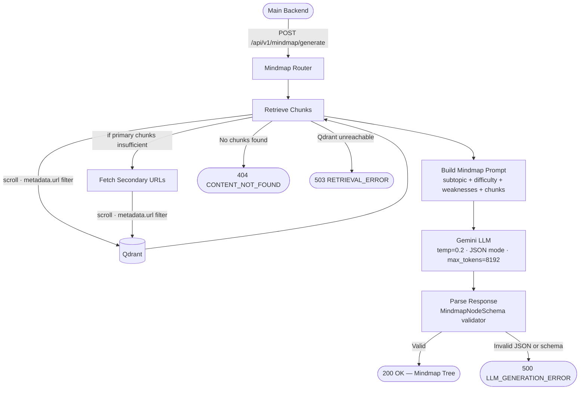

# API Contract — Mindmap Generation

## Overview

The Mindmap feature generates a personalized, hierarchical mind map from content already stored in Qdrant for a specific learning source. The Main Backend provides the user context, subtopic info, and source URLs directly in the request body — no additional backend call is made by the AI Service.



---

## 1. Request Details

- **Method:** `POST`
- **Endpoint:** `http://localhost:8000/api/v1/mindmap/generate`
- **Content-Type:** `application/json`

### JSON Body

```json
{
  "user_id": "user_123",
  "subtopic_id": "sub_456",
  "urls": [
    "https://www.coursera.org/learn/introduction-to-databases",
    "https://www.youtube.com/watch?v=xxx",
    "https://www.mongodb.com/nosql-explained"
  ],
  "primary_url": "https://www.coursera.org/learn/introduction-to-databases",
  "subtopic_name": "Database Fundamentals",
  "subtopic_difficulty": "Beginner",
  "weaknesses": {
    "Normalization": "Struggles with 2NF and 3NF concepts"
  }
}
```

### Field Definitions

| Field | Type | Required | Description |
|---|---|---|---|
| `user_id` | string | **Yes** | Unique user identifier |
| `subtopic_id` | string | **Yes** | Unique subtopic identifier |
| `urls` | string[] | **Yes** | All candidate source URLs for the subtopic |
| `primary_url` | string (URL) | **Yes** | The main content URL — must be one of the values in `urls` |
| `subtopic_name` | string | **Yes** | Used as the root node title of the mind map |
| `subtopic_difficulty` | string | **Yes** | Controls depth and complexity: Beginner / Intermediate / Advanced |
| `weaknesses` | object \| null | No | Key-value pairs of topic → weakness description |

> **Validation:** `primary_url` must be present in the `urls` array. A `422` is returned if this constraint is violated.

---

## 2. Response Details

- **Status:** `200 OK`

### JSON Body

```json
{
  "user_id": "user_123",
  "subtopic_id": "sub_456",
  "mindmap": {
    "topic": "Database Fundamentals",
    "description": "Comprehensive overview of relational database principles.",
    "children": [
      {
        "topic": "Core Concepts",
        "description": "Foundational blocks of DBMS.",
        "children": [
          {
            "topic": "Relational Model",
            "description": "",
            "children": []
          }
        ]
      }
    ]
  }
}
```

### Response Schema

| Field | Type | Description |
|---|---|---|
| `user_id` | string | Echoed from the request |
| `subtopic_id` | string | Echoed from the request |
| `mindmap` | MindmapNode | Root node of the mind map tree |

### MindmapNode (Recursive)

| Field | Type | Description |
|---|---|---|
| `topic` | string | Node label — a single, concise concept |
| `description` | string | One-sentence explanation (empty string for leaf nodes) |
| `children` | MindmapNode[] | Child nodes — empty array `[]` for leaf nodes |

### Mind Map Structure Guarantees

| Property | Value |
|---|---|
| Root node topic | Always exactly equals `subtopic_name` from the request |
| Max depth | 2 levels (Root → Main Branch → Sub-topic) |
| Main branches | 4 to 5 branches |
| Sub-topics per branch | Up to 4 |
| Leaf descriptions | Always empty string `""` |

---

## 3. Retrieval Strategy

The mindmap retriever uses **scroll-based retrieval** (not similarity search):

1. Fetches up to `PRIMARY_URL_CHUNKS_LIMIT` (default: 15) chunks from the `primary_url`
2. If the primary URL yields fewer chunks than the limit, secondary URLs are fetched concurrently — up to `SECONDARY_URL_CHUNKS_LIMIT` (default: 5) chunks per URL
3. All chunks are filtered strictly by `metadata.url` in Qdrant — no semantic approximation

---

## 4. Error Handling

| HTTP Status | Error Code | Reason |
|---|---|---|
| `422 Unprocessable Entity` | `VALIDATION_ERROR` | Missing or invalid fields, or `primary_url` not in `urls` |
| `404 Not Found` | `CONTENT_NOT_FOUND` | No chunks found in Qdrant for the given URLs |
| `503 Service Unavailable` | `RETRIEVAL_ERROR` | Qdrant is unreachable or scroll failed |
| `500 Internal Server Error` | `LLM_GENERATION_ERROR` | Gemini returned an empty, invalid JSON, or non-conforming response |

---

## 5. Prerequisites

**Important:** Mindmap generation requires content to be pre-stored in Qdrant. The Main Backend **must** call `POST /api/v1/roadmap/generate` successfully for the given `user_id` and `subtopic_id` before requesting a mindmap. The roadmap endpoint handles ingestion automatically as a background task.
