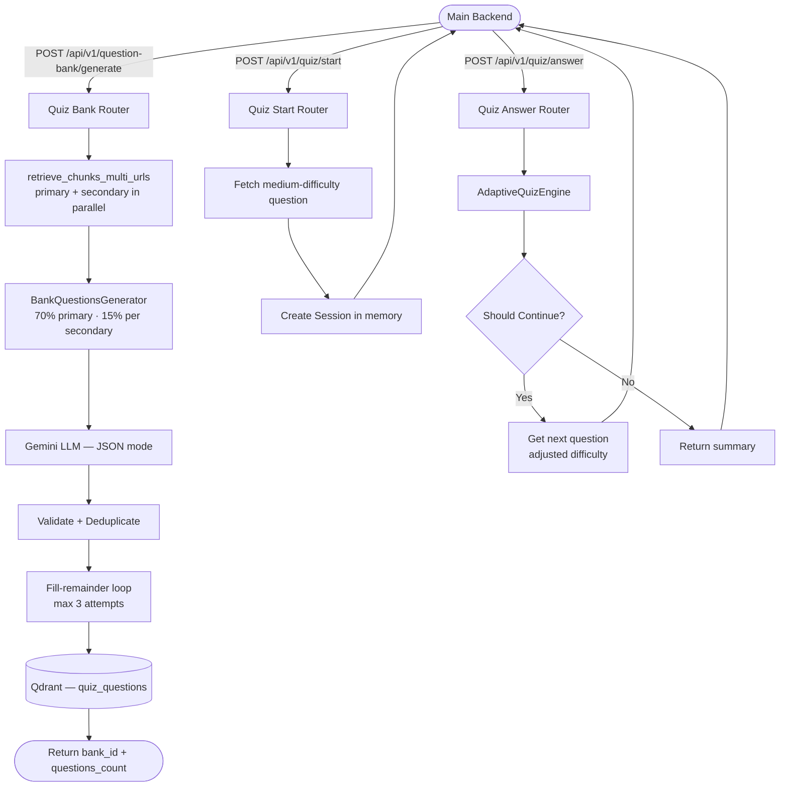

# API Contract — Quiz Feature

## Overview

The Quiz feature consists of two independent flows:

1. **Bank Generation** — transforms stored Qdrant content into a question bank of 100 MCQ questions.
2. **Quiz Session** — delivers questions adaptively using a confidence-based engine that adjusts difficulty in real time.

> **Prerequisite:** `POST /api/v1/roadmap/generate` must have been called successfully for the given URLs before requesting quiz generation. The roadmap endpoint handles Qdrant ingestion automatically as a background task.



---

## 1. Question Bank Generation

### Request

```http
POST /api/v1/question-bank/generate
Content-Type: application/json
```

```json
{
  "user_id": "user_123",
  "subtopic_id": "sub_456",
  "urls": [
    "https://www.coursera.org/learn/introduction-to-databases",
    "https://www.youtube.com/watch?v=xxx",
    "https://www.mongodb.com/nosql-explained"
  ],
  "primary_url": "https://www.youtube.com/watch?v=xxx",
  "subtopic_name": "Database Fundamentals",
  "subtopic_difficulty": "Beginner",
  "weaknesses": {
    "Normalization": "Struggles with 2NF and 3NF concepts"
  }
}
```

#### Field Definitions

| Field | Type | Required | Description |
|---|---|---|---|
| `user_id` | string | **Yes** | Unique user identifier |
| `subtopic_id` | string | **Yes** | Unique subtopic identifier |
| `urls` | string[] | **Yes** | All source URLs — used for chunk retrieval |
| `primary_url` | string (URL) | **Yes** | Main content source — must be in `urls` |
| `subtopic_name` | string | **Yes** | Topic label |
| `subtopic_difficulty` | string | No | `Beginner` / `Intermediate` / `Advanced` (default: `Intermediate`) |
| `weaknesses` | object \| null | No | Key-value pairs of topic → weakness description |

> **Validation:** `primary_url` must be present in the `urls` array. A `422` is returned if this constraint is violated.

### Response — `200 OK`

```json
{
  "bank_id": "f47ac10b-58cc-4372-a567-0e02b2c3d479",
  "subtopic_id": "sub_456",
  "questions_count": 100,
  "message": "Question bank generated and stored successfully."
}
```

| Field | Type | Description |
|---|---|---|
| `bank_id` | string (UUID) | Auto-generated ID — use this in `/quiz/start` |
| `subtopic_id` | string | Echoed from request |
| `questions_count` | integer | Total unique questions stored |
| `message` | string | Success message |

### Generation Details

| Property | Value |
|---|---|
| Total questions target | 100 (configurable via `QUIZ_BANK_SIZE`) |
| Primary source share | 70% (70 questions) |
| Secondary source share | 15% per source, max 2 secondary sources used |
| Difficulty distribution | Equal thirds: easy / medium / hard |
| Deduplication | Normalized text comparison (punctuation stripped, lowercased) |
| Fill-remainder attempts | Up to 3 retries from primary source if target not reached |
| Chunk retrieval | Parallel across all URLs; primary chunks tagged `is_primary=True` |

### Question Schema (stored in Qdrant)

Each stored question has the following structure:

```json
{
  "question_id": "uuid-string",
  "bank_id": "uuid-string",
  "subtopic_id": "sub_456",
  "source_url": "https://www.youtube.com/watch?v=xxx",
  "content": "What does 2NF stand for?",
  "options": [
    "Second Normal Form",
    "Second Numeric Format",
    "Standard Normal Form",
    "Structured Null Format"
  ],
  "correct_answer": "Second Normal Form",
  "difficulty": "easy",
  "explanations": {
    "Second Normal Form": "Correct — 2NF eliminates partial dependencies on the primary key.",
    "Second Numeric Format": "Incorrect — this is not a database term.",
    "Standard Normal Form": "Incorrect — no such normalization form exists.",
    "Structured Null Format": "Incorrect — unrelated to normalization."
  }
}
```

> **Note:** The `explanations` object keys **must exactly match** the strings in the `options` array.

### Error Handling

| HTTP Status | Reason |
|---|---|
| `422 Unprocessable Entity` | Missing/invalid fields, or `primary_url` not in `urls` |
| `400 Bad Request` | No content found in Qdrant for the provided URLs |
| `502 Bad Gateway` | LLM generation or response parsing failed |
| `500 Internal Server Error` | LLM returned questions but all failed validation |

---

## 2. Start Quiz Session

### Request

```http
POST /api/v1/quiz/start
Content-Type: application/json
```

```json
{
  "bank_id": "f47ac10b-58cc-4372-a567-0e02b2c3d479",
  "user_id": "user_123"
}
```

| Field | Type | Required | Description |
|---|---|---|---|
| `bank_id` | string | **Yes** | Bank ID returned from `/question-bank/generate` |
| `user_id` | string | **Yes** | Unique user identifier |

### Response — `200 OK`

```json
{
  "session_id": "9b1deb4d-3b7d-4bad-9bdd-2b0d7b3dcb6d",
  "status": "ongoing",
  "question": {
    "question_id": "a3bb189e-8bf9-3888-9907-79a7af9c5566",
    "bank_id": "f47ac10b-58cc-4372-a567-0e02b2c3d479",
    "subtopic_id": "sub_456",
    "source_url": "https://www.youtube.com/watch?v=xxx",
    "content": "Which SQL clause filters rows after aggregation?",
    "options": ["WHERE", "HAVING", "GROUP BY", "ORDER BY"],
    "correct_answer": "HAVING",
    "difficulty": "medium",
    "explanations": {
      "WHERE": "Incorrect — WHERE filters rows before aggregation.",
      "HAVING": "Correct — HAVING filters groups after GROUP BY aggregation.",
      "GROUP BY": "Incorrect — GROUP BY groups rows, it does not filter them.",
      "ORDER BY": "Incorrect — ORDER BY sorts results, it does not filter."
    }
  }
}
```

> **First question is always `medium` difficulty.** The session is stored in memory — sessions are lost on server restart.

### Error Handling

| HTTP Status | Reason |
|---|---|
| `404 Not Found` | No questions found for the given `bank_id` |

---

## 3. Submit Answer

### Request

```http
POST /api/v1/quiz/answer
Content-Type: application/json
```

```json
{
  "session_id": "9b1deb4d-3b7d-4bad-9bdd-2b0d7b3dcb6d",
  "question_id": "a3bb189e-8bf9-3888-9907-79a7af9c5566",
  "is_correct": true,
  "response_time": 12.4
}
```

| Field | Type | Required | Description |
|---|---|---|---|
| `session_id` | string | **Yes** | Session ID from `/quiz/start` |
| `question_id` | string | **Yes** | ID of the question being answered |
| `is_correct` | boolean | **Yes** | Whether the user's answer was correct |
| `response_time` | float (≥ 0) | **Yes** | Time taken to answer in seconds |

### Response — Quiz Ongoing — `200 OK`

```json
{
  "session_id": "9b1deb4d-3b7d-4bad-9bdd-2b0d7b3dcb6d",
  "status": "ongoing",
  "next_question": {
    "question_id": "c2f4e6a8-1234-5678-abcd-ef0123456789",
    "bank_id": "f47ac10b-58cc-4372-a567-0e02b2c3d479",
    "subtopic_id": "sub_456",
    "source_url": "https://www.coursera.org/learn/introduction-to-databases",
    "content": "What property ensures a transaction is fully completed or fully rolled back?",
    "options": ["Consistency", "Isolation", "Atomicity", "Durability"],
    "correct_answer": "Atomicity",
    "difficulty": "hard",
    "explanations": {
      "Consistency": "Incorrect — Consistency ensures the DB moves from one valid state to another.",
      "Isolation": "Incorrect — Isolation ensures concurrent transactions do not interfere.",
      "Atomicity": "Correct — Atomicity guarantees all-or-nothing execution.",
      "Durability": "Incorrect — Durability ensures committed data survives failures."
    }
  }
}
```

### Response — Quiz Finished — `200 OK`

```json
{
  "session_id": "9b1deb4d-3b7d-4bad-9bdd-2b0d7b3dcb6d",
  "status": "finished",
  "summary": {
    "total_questions_answered": 10,
    "correct_answers": 8,
    "average_response_time": 9.3,
    "final_confidence_score": 0.82
  }
}
```

| Field | Type | Description |
|---|---|---|
| `total_questions_answered` | integer | Total questions answered in this session |
| `correct_answers` | integer | Number of correct answers |
| `average_response_time` | float | Average seconds per question |
| `final_confidence_score` | float (0.0–1.0) | Composite confidence score at session end |

### Error Handling

| HTTP Status | Reason |
|---|---|
| `404 Not Found` | `session_id` does not exist or has already finished |

---

## 4. Adaptive Engine Logic

### Difficulty Routing

The engine selects the next question difficulty based on correctness, response time, and answer streaks:

| Condition | Next Difficulty |
|---|---|
| Correct + fast (≤ 80% expected time) OR 2+ consecutive correct | Increase by one level |
| Correct at max difficulty (`hard`) | Stay at `hard` |
| Wrong + 2 consecutive wrong | Decrease by one level |
| Wrong + slow (≥ 120% expected time) | Decrease by one level |
| Otherwise | Stay at current difficulty |

Expected response times: `easy` → 20s, `medium` → 30s, `hard` → 45s.

### Stopping Conditions

The quiz ends when **any** of the following is true:

| Condition | Trigger |
|---|---|
| Max questions reached | 15 questions answered |
| High confidence | Score ≥ 0.85 (checked after minimum 5 questions) |
| Mastery detected | 3 consecutive correct at `hard` difficulty |
| Struggling detected | 3 consecutive wrong at `easy` difficulty |
| No more questions | All available questions in bank already asked |

### Confidence Score Formula

```
score = (recent_accuracy_last_5 × 0.35)
      + (consistency_score       × 0.25)
      + (question_count_progress × 0.25)
      + (speed_score             × 0.15)
```

- **recent_accuracy**: fraction correct in last 5 answers
- **consistency_score**: `max(0, 1 - 4 × variance)` of last 5 binary outcomes
- **question_count_progress**: `min(total_answered / 15, 1.0)`
- **speed_score**: average per-question score based on time ratio vs expected time (1.0 if ≤ 80%, down to 0.2 if > 150%)

---

## 5. Qdrant Storage (quiz_questions collection)

| Property | Value |
|---|---|
| Collection name | `quiz_questions` (configurable via `QUIZ_COLLECTION_NAME`) |
| Vector size | `1` (dummy vector — retrieval is payload-based only) |
| Distance metric | `DOT` |
| Retrieval method | Scroll filtered by `bank_id` + optional `difficulty`, excluding already-asked `question_id`s |
| Candidate pool | 15 records per scroll call, one selected at random |
