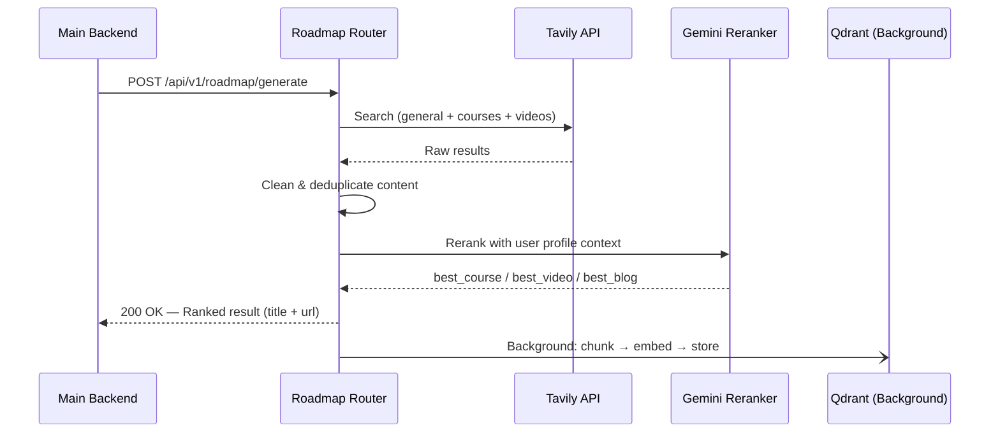

# API Contract — Roadmap Generation

## Overview

The Roadmap feature accepts user preferences and subtopic details from the Main Backend, fetches and ranks real-time learning content using Tavily + Gemini, stores the results in Qdrant as a background task, and returns the best course, video, and blog for the learner.



---

## 1. Request Details

- **Method:** `POST`
- **Endpoint:** `http://localhost:8000/api/v1/roadmap/generate`
- **Content-Type:** `application/json`

### JSON Body

```json
{
  "user_profile_schema": {
    "id": "user_123",
    "tracks": ["Backend Development"],
    "learningStyle": "Visual",
    "currentGoal": "Build scalable microservices",
    "studyTimePerWeek": "10-15 hours",
    "role": "STUDENT"
  },
  "target_subtopic_schema": {
    "Subtopic_id": "sub_456",
    "Name": "Database Fundamentals",
    "Description": "Basic concepts of relational and non-relational databases.",
    "Difficulty": "Beginner"
  },
  "weakness_schema": {
    "Topics": {
      "Concurrency": "Struggles with threading and async"
    }
  }
}
```

### Field Definitions

| Field | Type | Required | Description |
|---|---|---|---|
| `user_profile_schema.id` | string | **Yes** | Unique user identifier |
| `user_profile_schema.tracks` | string[] | **Yes** | Learning tracks (e.g. Backend, AI) |
| `user_profile_schema.learningStyle` | string | No | e.g. Visual, Auditory, Reading |
| `user_profile_schema.currentGoal` | string | No | User's current learning goal |
| `user_profile_schema.studyTimePerWeek` | string | No | e.g. "10-15 hours" |
| `user_profile_schema.role` | string | **Yes** | e.g. STUDENT, PROFESSIONAL |
| `target_subtopic_schema.Subtopic_id` | string | **Yes** | Unique subtopic identifier |
| `target_subtopic_schema.Name` | string | **Yes** | Subtopic title |
| `target_subtopic_schema.Description` | string | **Yes** | Detailed description |
| `target_subtopic_schema.Difficulty` | string | **Yes** | Beginner / Intermediate / Advanced |
| `weakness_schema.Topics` | object | **Yes** | Map of topic → weakness description (can be empty `{}`) |

---

## 2. Response Details

- **Status:** `200 OK`

### JSON Body

```json
{
  "user_id": "user_123",
  "subtopic_id": "sub_456",
  "best_course": {
    "title": "Introduction to Databases | Coursera",
    "url": "https://www.coursera.org/learn/introduction-to-databases"
  },
  "best_video": {
    "title": "Database Fundamentals for Beginners - YouTube",
    "url": "https://www.youtube.com/watch?v=example"
  },
  "best_blog": {
    "title": "Database Fundamentals | Microsoft Learn",
    "url": "https://learn.microsoft.com/en-us/shows/dbfundamentals/"
  }
}
```

### Response Schema

| Field | Type | Description |
|---|---|---|
| `user_id` | string | Echoed from request |
| `subtopic_id` | string | Echoed from request |
| `best_course` | RankedSource \| null | Best course found (or null if none) |
| `best_video` | RankedSource \| null | Best YouTube video found (or null if none) |
| `best_blog` | RankedSource \| null | Best blog/article found (or null if none) |

### RankedSource Object

| Field | Type | Description |
|---|---|---|
| `title` | string | Source title |
| `url` | string | Source URL |

> **Note:** `raw_content` and `reason` are **never** returned to the Main Backend. They are internal fields used only during the pipeline.

---

## 3. Background Behavior

After returning the response, the AI Service runs a background task to:

1. Check if each source URL already exists in Qdrant (deduplication)
2. Clean and semantically chunk the raw content
3. Embed chunks using `paraphrase-multilingual-mpnet-base-v2`
4. Store chunks in Qdrant under `metadata.url` for future retrieval

The Main Backend does **not** need to wait for this — it is fully async and fire-and-forget.

---

## 4. Error Handling

| HTTP Status | Reason |
|---|---|
| `422 Unprocessable Entity` | Missing or invalid fields in the request body |
| `503 Service Unavailable` | Tavily search failed (network or API error) |
| `500 Internal Server Error` | LLM reranker failed to return a valid response |
