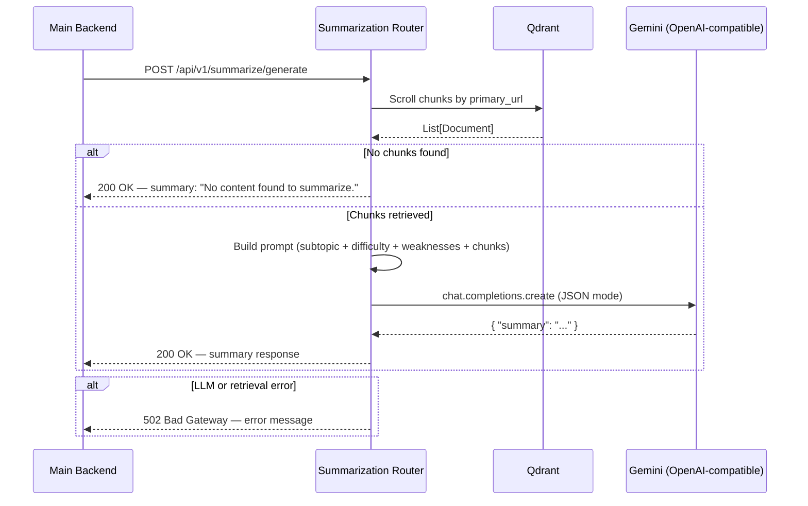

# API Contract — Summarization

## Overview

The Summarization feature generates a structured, beginner-friendly summary by retrieving relevant content chunks from Qdrant (filtered by `primary_url`) and passing them through a Gemini LLM via an OpenAI-compatible endpoint. The summary is personalized based on the learner's difficulty level and known weaknesses.



---

## 1. Request Details

- **Method:** `POST`
- **Endpoint:** `http://localhost:8000/api/v1/summarize/generate`
- **Content-Type:** `application/json`

### JSON Body

```json
{
  "user_id": "user_123",
  "subtopic_id": "sub_456",
  "urls": [
    "https://www.coursera.org/learn/introduction-to-databases",
    "https://www.youtube.com/watch?v=xxx",
    "https://www.mongodb.com/nosql-explained"
  ],
  "primary_url": "https://www.youtube.com/watch?v=xxx",
  "subtopic_name": "Database Fundamentals",
  "subtopic_difficulty": "Beginner",
  "weaknesses": {
    "Normalization": "Struggles with 2NF and 3NF concepts"
  }
}
```

### Field Definitions

| Field | Type | Required | Description |
|---|---|---|---|
| `user_id` | string | **Yes** | Unique user identifier |
| `subtopic_id` | string | **Yes** | Unique subtopic identifier |
| `urls` | string[] | No | All candidate source URLs (used for context, not retrieval) |
| `primary_url` | string (URL) | **Yes** | The content source to summarize — must exist in Qdrant |
| `subtopic_name` | string | **Yes** | The topic being summarized |
| `subtopic_difficulty` | string | No | Beginner / Intermediate / Advanced (default: Intermediate) |
| `weaknesses` | object | No | Key-value pairs of topic → weakness description |

---

## 2. Response Details

- **Status:** `200 OK`

### JSON Body

```json
{
  "user_id": "user_123",
  "subtopic_id": "sub_456",
  "primary_url": "https://www.youtube.com/watch?v=xxx",
  "summary": "# Database Fundamentals\n\n## What is a Database?\n..."
}
```

### Response Schema

| Field | Type | Description |
|---|---|---|
| `user_id` | string | Echoed from the request |
| `subtopic_id` | string | Echoed from the request |
| `primary_url` | string | Echoed from the request |
| `summary` | string | Markdown-formatted summary text |

### Summary Format

The LLM is instructed to return a Markdown-structured summary:

```markdown
# Topic Name

## Section 1
- Key point
- Key point with **bold term**

## Section 2
- ...
```

Rules enforced by the prompt:
- Language matches the original content (Arabic or English)
- Weaknesses are explicitly addressed with extra clarity
- No fabricated information outside the retrieved chunks
- Output is always valid JSON `{ "summary": "..." }` internally, unwrapped before returning

---

## 3. Retrieval Strategy

The summarizer uses `shared_retriever.retrieve_content_chunks`:

1. Fetches chunks from `primary_url` via Qdrant scroll (up to `PRIMARY_URL_CHUNKS_LIMIT` = 15 chunks)
2. Secondary URLs are **not** used for summarization (only `primary_url` is fetched)
3. If no chunks are found, returns a graceful `"No content found to summarize."` message — not an error

---

## 4. LLM Configuration

| Setting | Value |
|---|---|
| Model | `gemini-2.5-flash-lite` (via OpenAI-compatible endpoint) |
| Temperature | `0.3` |
| Response format | `json_object` |
| Retry on transient errors | Up to 2 retries |
| Timeout | 30 seconds per attempt |
| Endpoint | `https://generativelanguage.googleapis.com/v1beta/openai/` |

---

## 5. Error Handling

| HTTP Status | Reason |
|---|---|
| `422 Unprocessable Entity` | Missing or invalid request fields |
| `200 OK` (with message) | No content found in Qdrant for `primary_url` — returns `"No content found to summarize."` |
| `502 Bad Gateway` | LLM failed (invalid JSON, missing summary field, connection error, or rate limit exhausted) |
| `502 Bad Gateway` | Qdrant retrieval failed with an internal error |

---

## 6. Prerequisites

**Important:** Summarization requires content to be pre-stored in Qdrant. The Main Backend **must** call `POST /api/v1/roadmap/generate` successfully before requesting a summary for a given `primary_url`. The roadmap endpoint handles Qdrant ingestion automatically as a background task.
